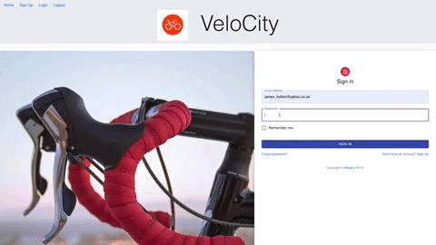

# VeloCity - README

This Bike Component Tracking App was built as a final project of the 16 week Makers Academy Junior Software development course in November 2019. The aim of the project is to work as a team to build a full stack software application that both reinforces the learning of the course to date and demonstrates our skills as junior full stack devs. The exact functionality and technical specifications of the App were down to us to decide.

## What the App has been written for
This application works hand in hand with the Activity Logging site Strava.  The problem we have solved is that knowing how far your bike has ridden does not help you judge whether the components on the bike need replacing.

This App monitors the individual components on a bike, and tracks ther use, letting the user know when they have reached their recommended replacement distance.

Main contributors:

* [Karlo De Guzman](https://github.com/kdeg0040)
* [Gabriel Gonzalez](https://github.com/gabokappa)
* [James Holtan](https://github.com/BigTallJim)
* [Eduard Kulcsickij-Gut](https://github.com/EdZeno)
* [Thomas Ross](https://github.com/Gotteschalk)


## Table of contents
* [Installation](#installation)
* [Usage](#usage)
* [User stories](#user-stories)
* [Approach](#approach)

## Installation
To get a development environment running please clone this repo in your desired directory:
```
$ git clone git@github.com:gabokappa/VeloCity.git
```
- Install gems and dependencies
```
$ bundle install
$ npm install --check-files
$ yarn install
```
- Create development and test env databases and tables
```
$ rails db:create
$ rails db:migrate
$ rails db:migrate RAILS_ENV=test
```
- Start local server and visit ```http://localhost:3000``` in browser to view VeloCity homepage
```
$ rails s
```
## User Stories
### Basic
```
As a bike enthusiast I want to know when I need to change a bike component
As a user I want to log into the application to see personalised information about my bike
As a bike enthusiast I want to know how many miles until I need to change my components
As a user I want to be able to add components to be tracked (input brand, first usage date, lifespan)
```
### Advanced
```
As a user I want to be able to tell the app when I have replaced a part
As a user I want to be able to add a different bike to track its components
As a user I want the app to make recommendations on lifespan
```
## Usage

SignUp - New user signs up to the app


Authorize Strava - after sign up the user is prompted to login to their Strava account and authorize our app to use it.


Log back into the account and retrieve bikes from Strava account through 'get bikes' button. This shoudl retrieve the distance in kilometers that your bike has done.



Add components


Refresh


## Technologies Used
| Technology | Description | Use |
| :--------------------------------: | :--------------------------------: | :--------------------------------: |
| Rails ~> v6.0.0 | Web app framework | Back-end API |
| React | JS framework | Front-end user interface |
| Strava API | Fitness activity tracker| Provide user cycling data |
| RSpec | Ruby test framework  | Test Rails models and controllers |
| Jest | React test framework | Test React components |
| Cypress | End-to-end test framework | Test features |
| Postman | HTTP API interface | Simulate HTTP requests |
| ESLint | JS linter | Maintain JS code quality |
| RuboCop | Ruby linter | Maintain Ruby code quality |
| JWT | JSON Web Tokens | Manage authentication |
| PostgreSQL | Database management system | Store app data in database |
| JQuery | JS library | Add dynamic front-end behaviour |

## Development process
TDD processes have been followed in the development of this application.  There have been times when spiking the code was necessary, such as the testing of the Strava API's.

